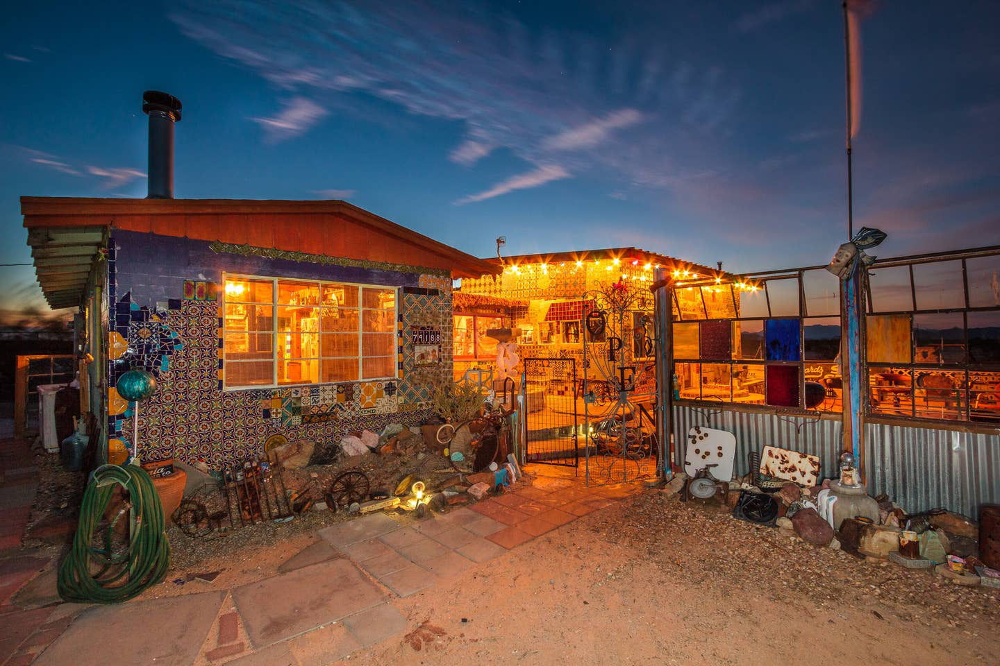
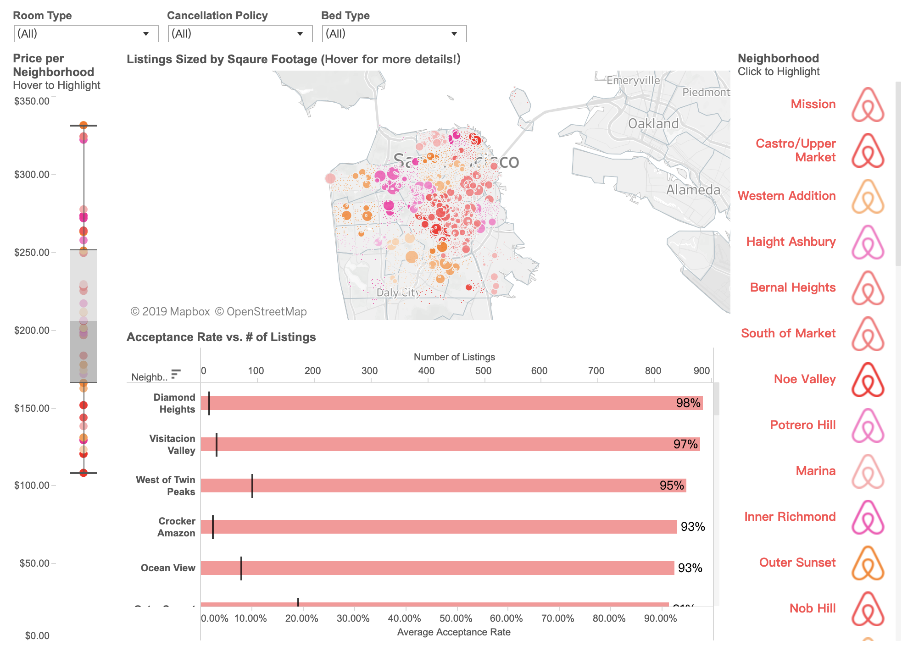

# INF 554 Assignment for 5

### Cover slide (manual advance not included in time)
- Title: Deep Trip to California with D3
- Group Name: Undefined
- Names and email:
1. WeiFan Chen => weifanch@usc.edu
2. YenChen Chou => yenchenc@usc.edu
3. Runze Liu => runzeliu@usc.edu

### Introduction
- 10 words on what your visualization is about
1. Select best staying spots across multiple cities in California 

- Who is it addressed to, why it is interesting, important, useful?
1. Audience: For people who want prefer to have a deep travel in California
2. Why interesting: Provide a visual map to help traveler to see if they are choosing the right kind/type/price of staying spots
3. Why useful: 
    (1) Povide a way to quickly adjust thier stays
    (2) Find the lowest price according user's requirement

### Your visualization
- What is the topic?
1. Visual map for staying spot comparision

- What is the information you plan to present?
1. Visual map with price tag on the location
2. Visual information on the spots you select and show and difference
2. Point out what features might affect the price, such as room type, facilities, home surrounding style
3. Deeper comparison on the selected spots. Such as radar chart on the facilities, price, room type

- Do you have a story?
I prefered to have a deep travlel on a certain state, I selected the place based on the sites you prefer to visit through websites such as booking and trivago to look for the desire places to stay. Then, I had to do it again when I wanted to search for another place. I also had to google it to know the places I booked. So, an idea popped up at that moment, why not showing all the best places at one time according to my need and give a brief overview right away?

### Secret sauce
How your visualization compares to what others have done on the same and different topics?
Quick comparison on staying spots through visual map

### What is your plan
- What data you will use? Airbnb open data focus on 8 cities in California
- Design plans, technology, building and evaluating, risks you identified
1. Python: 
     (1) Data preprocessing
     (2) Data cleaning
2. D3:
     (1) Data Visualization
3. HTML/CSS/Javacsript:
     (1) result representation

- How do you work together?
All of the tasks will be discussed about the approaches to take and the tools might be used by all teammembers. After that, the work will be done individually.

### Timeline
1. 10/10/2019: data cleaning and preprocessing
2. 10/12/2019: data preparation for visualizartion
3. 11/10/2019: finish the visualization mentioned above
4. 11/24/2019: testing the results

### The team
Why you are confident you can deliver and the resources you will leverage

## PNG file provenance
* 1. https://unsplash.com

* 2. https://unsplash.com

* 3. https://unsplash.com

* 4. https://www.google.com/search?biw=1440&bih=740&tbm=isch&sa=1&ei=sP2SXZCSJtat0PEPvOiUoAU&q=houese&oq=houese&gs_l=img.3..0i10i19.624210.624963..625072...0.0..0.221.724.2j3j1....3..0....1..gws-wiz-img.......0j0i10j0i30j0i10i30.Zvi5hP50Zew&ved=0ahUKEwiQqoG8wvrkAhXWFjQIHTw0BVQQ4dUDCAc&uact=5#imgrc=lr_fdbgKcDSA9M: 

* 5. https://airbnb.com

* 6. http://databrit.blogspot.com/2015/10/the-story-behind-my-viz-of-day-on-airbnb.html 

* 7. https://booking.com

* 8. https://twitter.com/UniTaughtMe/status/594906049351655426/photo/1

* 9. https://unsplash.com

* 10. https://unsplash.com
